# README

This README would normally document whatever steps are necessary to get the
application up and running.

Things you may want to cover:

<h3> Multi Tenant Application Implemented using Single DB </h3>

Pre-requisite: 
  Ruby : 3.3.1 

Step 1: bundle install

Step 2: rails db:drop 

Step 3: rails db:create

Step 4: rails db:migrate

Step 5: rails db:seed (Insert one user as admin, otherwise all users are treated only as tenant)

Step 6: rails server

Note: Admin login 

email: admin@gmail.com  
password: adminadmin

Page 1: Sign In 

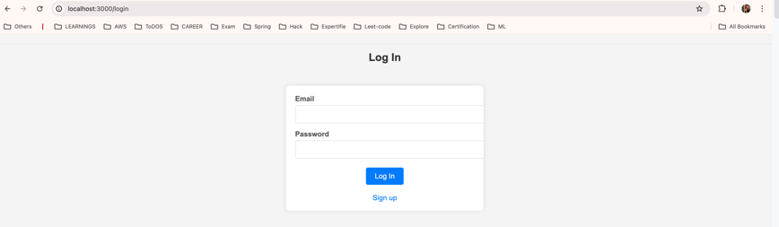

Page 2: Admin Log in

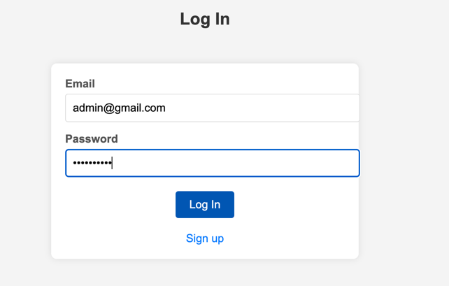

Page 3: Admin Home Page

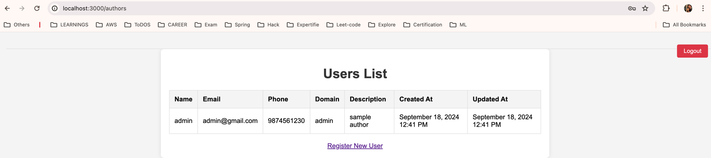

Page 4: Sign up

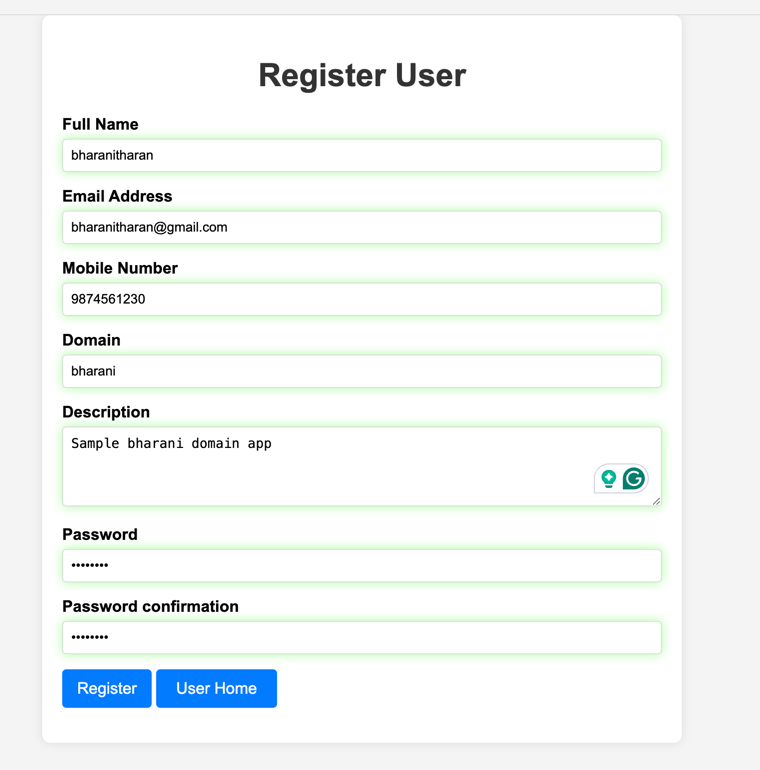

Page 5: Successful Sign up 

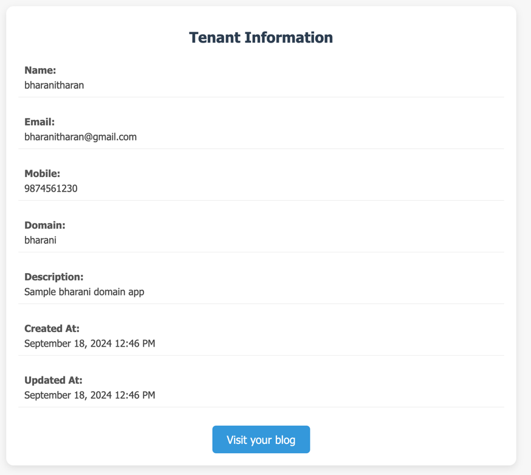

Page 6: Auto Re-direction for blog

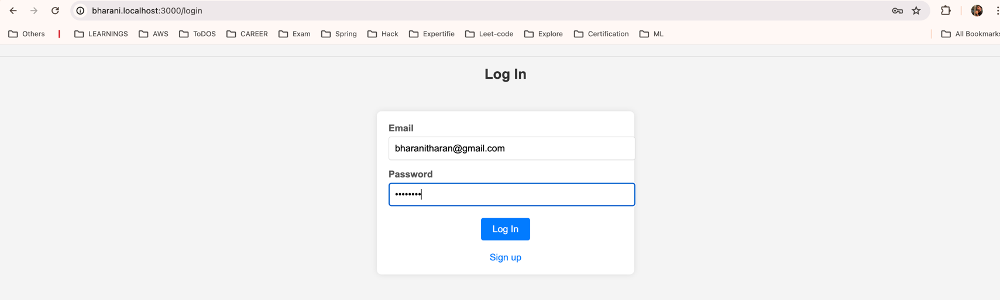

Page 7: Tenant's home Page 

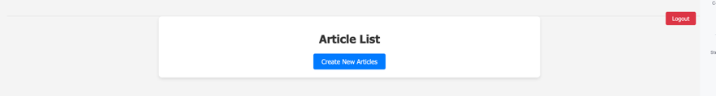

Page 8: Creating a blog

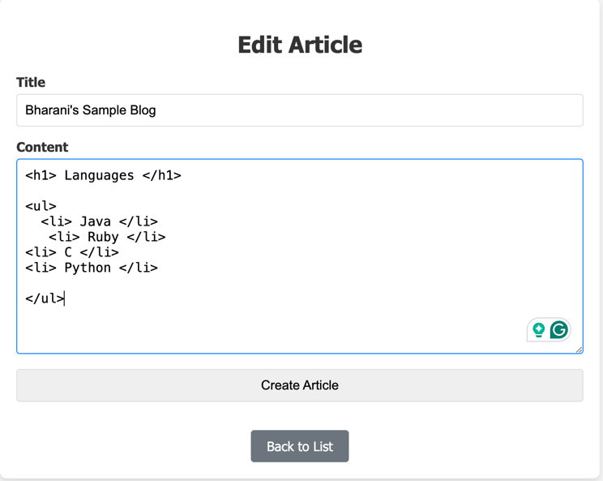

Page 9: Created Blog

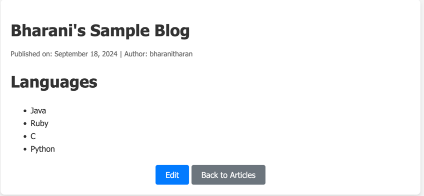

Page 10: List of Articles 

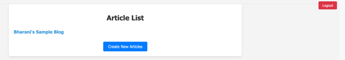

Page 11: Logout 

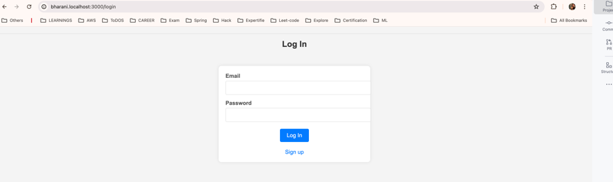

